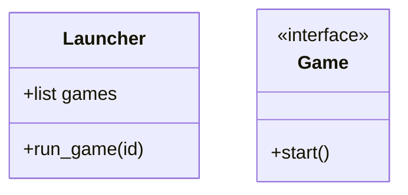

Game Launcher Project Workflow
## 🔧 План исправлений (5 дней)

### День 1: Рефакторинг архитектуры
```diff
// Было:
class dino_game : public launcher_game, public menu_launcher {...};

// Стало:
class GameBase {
public:
    virtual void render() = 0;
    virtual void handle_input() = 0;
};

class DinoGame : public GameBase {...};
```

### День 2: Система окон
```cpp
// Отдельный класс WindowManager:
class Window {
private:
    GLFWwindow* glfw_window;
public:
    void create_window(int w, int h);
    void render_ui();
};
```

### День 3: Интеграция OpenGL
1. Добавить `glad/gl.h`
2. Реализовать базовый шейдер:
```glsl
#version 330 core
layout(location = 0) in vec2 pos;
void main() {
    gl_Position = vec4(pos, 0.0, 1.0);
}
```

### День 4: Лаунчер


### День 5: Пул-реквест
1. Создать ветку `feature/launcher-v2`
2. Открыть PR с тегами:
```markdown
## Changes:
- [x] Новая архитектура
- [ ] Добавлен OpenGL рендеринг
```

## 🛠️ Git Workflow (как в компании)
1. Все изменения в отдельных ветках:
```bash
git checkout -b feature/input-system
```
2. Перед PR:
```bash
git rebase main
git push origin feature/input-system
```
3. Создаем PR через GitHub UI

## 📅 Ежедневные задачи

### День 1:
- [ ] Вынести общую логику в `GameBase`
- [ ] Убрать множественное наследование

### День 2:
- [ ] Реализовать `WindowManager`
- [ ] Настроить CMake для OpenGL

### День 3:
- [ ] Добавить шейдеры
- [ ] Отрисовать первый квад

### День 4:
- [ ] Загрузка игр через лаунчер
- [ ] Кнопка "Back to menu"

### День 5:
- [ ] Написать тесты
- [ ] Оформить PR

## 📌 Code Review Checklist
При отправке PR проверяйте:
1. Нет утечек памяти (Valgrind)
2. Соответствие стилю (clang-format)
3. Работоспособность всех 3 игр

## 🔗 Полезные ссылки
1. [Learn OpenGL](https://learnopengl.com)
2. [GLFW docs](https://www.glfw.org/docs/latest/)
3. [GitHub PR Guide](https://docs.github.com/en/pull-requests)
```

## Как работать с этим планом:
1. Сохраните как `WORKFLOW.md` в репозитории
2. Каждый день отмечайте выполненные задачи
3. Перед PR проверяйте чеклист
4. Для ревью кода делайте:
```bash
git diff main..feature/your-branch > review.patch
```

Рекомендую:
1. Убрать вложенные классы окон
2. Использовать паттерн "Состояние" для переключения между играми
3. Для UI добавить ImGui вместо чистого OpenGL

Хотите, чтобы я сделал полный ревью вашего кода после Day 1? Пришлите ссылку на PR когда будете готовы.
